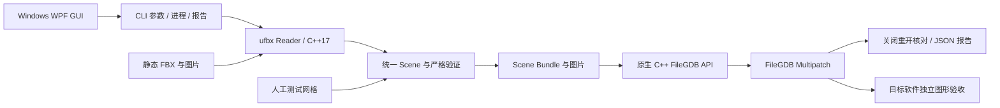

# V0.1.5 架构

Reader 与数据库 SDK 无直接依赖。C++ 内核使用 `gmb::Scene` 表达 Nodes、Meshes、Materials、Textures、坐标元数据与诊断。节点实例展开为独立网格；顶点保留完整角点，不能只按位置合并 UV/法线接缝。节点变换、轴向、单位和 origin 在中间包前完成，写入端不得重复变换。

GUI 是自包含 WPF 程序，通过无 shell 的参数数组调用 CLI。CLI 只发现 `native-filegdb/GeoModelBridge.NativeWriter.exe` 或显式配置的原生可执行程序；不调用托管 DLL、Pro 授权初始化或 ArcPy。移除后端的请求、错误后端的报告均被拒绝。

Scene Bundle 是 JSON 与资源文件组成的进程边界。CLI 默认严格模式，GUI 默认显式 GIS 静态兼容；`conversion_profile` 随 bundle 和报告传递并核对。兼容处理发生在 Reader，写入端仍执行完整几何、UV、材质和纹理检查。V0.1.4 引入的流式 JSON 写出与有界日志保留。[协议](bundle-format.md) · [转换策略](compatibility.md)

原生端以 MSVC x64 编译，链接官方 FileGDB API 1.5.5 和 Windows 系统组件，WIC 解码图片。按官方扩展 Shape Buffer 文档构造 Multipatch，每网格一个要素，三角形按材质分 patch。PNG 解码为未预乘 RGBA8，JPEG 保留支持的容器字节，所有有 UV 的 patch 写入 `S=U,T=1-V`。不翻转图片行序、不静默丢弃未知材质通道。

数据库先写入本次创建的暂存目录，关闭重开后核对几何、材质、纹理及存储精度，通过才提交最终路径。独立副本模式只凭源报告核对要素属性与 ShapeBuffer SHA-256，不读取 FBX、bundle 或源贴图。内容散列用于一致性比较，不是数字签名。单库单线程写入，清理只涉及本次创建的路径。

部署依赖为 Windows、Microsoft C++ 运行库和独立 FileGDB API。完整发布附带 release DLL、原始许可和来源散列；GUI 自带 .NET。构建、自动测试、样例生成及打包均无 Pro 依赖。历史跨 SDK 读取证据不作为当前发布门槛；图形验收单独记录。

CLI 退出码：0 成功；2 用法或已有路径冲突；3 策略验证不通过；4 不支持/不可用后端；5 写入端失败；6 解析、IO 或其他错误。`inspected`、`prepared`、`written_and_readback_verified` 表示不同阶段。

依据：[ufbx 节点与坐标](https://ufbx.github.io/elements/nodes/)、[网格与实例材质](https://ufbx.github.io/elements/meshes/)、[FileGDB API 官方仓库](https://github.com/Esri/file-geodatabase-api) 及 [固定 SDK 来源](../backends/native-filegdb/sdk-sources.json)。
