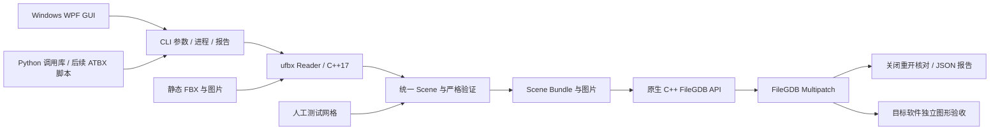

# V0.2.1 架构

构建统一由仓库根目录一个 `CMakeLists.txt` 定义，默认产生 CLI、原生 writer 及 SDK 运行库。`backends/native-filegdb` 仍是源码模块，但不是独立构建工程。两程序继续通过子进程和 Scene Bundle 通信，构建合并不改变运行时协议。

Reader 与数据库 SDK 无直接依赖。C++ 内核使用 `gmb::Scene` 表达 Nodes、Meshes、Materials、Textures、坐标元数据与诊断。节点实例展开为独立网格；顶点保留完整角点，不能只按位置合并 UV/法线接缝。节点变换、轴向、单位和 origin 在中间包前完成，写入端不得重复变换。

V0.1.12 的 Reader 把贴图查询结果区分为“找到路径 / 确认缺失 / 查询失败”，按 ufbx texture 对象在本次读取内缓存；材质检查只对确认缺失的图片应用回退。查询失败与非普通文件产生明确的读取错误，路径成功解析不代替后续图片字节校验。Windows 将部分错误父路径报告为不存在，因此另行检查最近的已有父目录，保持两平台判定一致。

GUI 是自包含 WPF 程序，通过无 shell 的参数数组调用 CLI。CLI 只发现 `native-filegdb/GeoModelBridge.NativeWriter`（Windows 加 `.exe`） 或显式配置的原生可执行程序；不调用托管 DLL、Pro 授权初始化或 ArcPy。移除后端的请求、错误后端的报告均被拒绝。

Scene Bundle 是 JSON 与资源文件组成的进程边界。CLI 默认严格渲染模式，GUI 默认显式 GIS 静态兼容；`conversion_profile` 随 bundle 和报告传递并核对。独立的 `missing_texture_policy` 默认 `material-color`：Reader 对找不到的图片保留材质颜色与标量透明度、清除图片绑定并告警；`error` 则拒绝。写入端仍执行完整几何、UV、材质和资源检查，不对损坏 Bundle 回退。V0.1.4 引入的流式 JSON 写出与有界日志保留。[协议](bundle-format.md) · [转换策略](compatibility.md)

原生端共用 C++17 源码，Windows 以 MSVC x64 编译并静态链接固定 libpng/zlib/libjpeg-turbo，Ubuntu 以 GCC 13 编译并动态链接系统 libpng/libjpeg，图片解码与完整性检查实现共用，各自链接官方 FileGDB API 1.5.5 平台 SDK。按官方扩展 Shape Buffer 文档构造 Multipatch，每网格一个要素，三角形按材质分 patch。PNG 解码为未预乘 RGBA8，JPEG 保留支持的容器字节，所有有 UV 的 patch 写入 `S=U,T=1-V`。不翻转图片行序、不静默丢弃未知材质通道。

数据库先写入本次创建的暂存目录，关闭重开后核对几何、材质、纹理及存储精度，通过才提交最终路径。独立副本模式只凭源报告核对要素属性与 ShapeBuffer SHA-256，不读取 FBX、bundle 或源贴图。内容散列用于一致性比较，不是数字签名。单库单线程写入，清理只涉及本次创建的路径。

Windows 部署依赖 Microsoft C++ 运行库与 FileGDB DLL；Ubuntu 24.04 x86_64 依赖 libstdc++、libpng/libjpeg 与两份 FileGDB 共享库。完整安装附带对应 SDK 运行库、原始许可和来源散列；GUI 只在 Windows 运行并自带 .NET。构建、自动测试、样例生成及打包均无 Pro 依赖。历史跨 SDK 读取证据不作为当前发布门槛；图形验收单独记录。

CLI 退出码：0 成功；2 用法或已有路径冲突；3 策略验证不通过；4 不支持/不可用后端；5 写入端失败；6 解析、IO 或其他错误。`inspected`、`prepared`、`written_and_readback_verified` 表示不同阶段。

V0.1.10 的报告保留 `coordinates`，三个调用入口核对目标 WKID 和已应用的 origin。Python 采用有界双路读取线程保留日志尾部，调用线程负责阶段消息；完成回调异常通过 `CallbackError.result` 保留已经核验的成果。CLI 的 writer 失败日志也只读取末尾固定大小，便于保留最终错误。

依据：[ufbx 节点与坐标](https://ufbx.github.io/elements/nodes/)、[网格与实例材质](https://ufbx.github.io/elements/meshes/)、[FileGDB API 官方仓库](https://github.com/Esri/file-geodatabase-api) 及 [固定 SDK 来源](../backends/native-filegdb/sdk-sources.json)。

## 跨平台维护边界

- `python/geomodelbridge` 封装参数、进程和报告契约，不包含 ArcPy、转换算法或数据库追加逻辑；Python / CLI / writer 必须版本匹配。CMake 安装与发布清单包含函数库，双平台测试使用安装后的库写入并复制回读 GDB。接口见 [Python 调用库](python-client.md)。
- `src/`、`include/`、`bundle.hpp`、`codec.hpp`、writer `main.cpp` 为共享业务逻辑，不复制 Linux 分支。
- 后端 `platform_windows.cpp` / `platform_linux.cpp` 负责 UTF-8 与 SDK wstring 转换、路径范围及平台运行时。Linux 使用 wchar32，不依赖系统 locale 的 filesystem wstring 转换。
- `include/gmb/output.hpp` 与 `src/platform_files_windows.cpp` / `src/platform_files_linux.cpp` 供核心和原生后端共用，负责链接检查、独占文件创建和禁止覆盖的提交；不依赖 FileGDB SDK。两种 CMake 构建入口都编译同一份实现。
- `images.cpp` 共享容器检查（含 PNG chunk CRC 与完整 IEND）；`images_png.cpp` / `images_jpeg.cpp` 在两平台共用严格 libpng/libjpeg 解码与扫描校验并拒绝解码恢复。PNG 为直通 RGBA8，不做 Gamma/ICC 或预乘；JPEG 检查后保留原字节。
- 根 CMake 的 `GMB_BUILD_NATIVE` 可构建完整链路；单独 native CMake 入口仍保留。Python 构建、下载、验证、样例和打包共用 `scripts/gmb_platform.py` 的平台布局。
- Linux install RPATH 只保留 `$ORIGIN`，两份 SDK 共享库可随目录移动；未附带 SDK 运行库时显式配置 `LD_LIBRARY_PATH`。从 PATH 启动的 CLI 通过 `/proc/self/exe` 找到相邻 writer。
- Windows 与 Ubuntu CI 都运行 CTest、真实 GDB 集成、独立目录部署和 14 个完整样例；WPF 服务测试由 Windows 执行。维护 master 共享代码，平台适配修改必须回归两侧。

V0.1.8 将原生 Scene JSON 读取改为缓冲输入与逐角点/三角形解码，避免整份 JSON 字节和 DOM 同时驻留。解析后仍保留类型化 Scene 与原生准备数据进行完整校验和回读；内存仍随模型规模增长，并非常量内存。GIS 静态法线修复只在 FBX Reader 进行，writer 保持严格验证。

## 输出保护约定

V0.1.11 的报告暂存文件通过独占创建获得所有权，写出并刷新完成后才提交；创建失败不删除碰撞到的文件。中间包仍先在本次独占创建的同级目录中写好 JSON、贴图和报告。并发任务之间只有一个能提交相同目标，失败任务清理自己的暂存路径，已有目标保持原样。

Windows 使用不带替换标志的 [MoveFileExW](https://learn.microsoft.com/en-us/windows/win32/api/winbase/nf-winbase-movefileexw)，Linux 使用 [renameat2(RENAME_NOREPLACE)](https://man7.org/linux/man-pages/man2/rename.2.html)。不使用“先检查不存在，再普通 rename”的回退；文件系统不支持禁止覆盖提交时返回失败。报告独占创建分别使用 CREATE_NEW 与 O_CREAT | O_EXCL。

核心报告、中间包和原生后端拒绝已有符号链接 / Windows 重解析点及其父目录。这是正常并发下的成果保护，不是抵御另一个进程在操作中恶意替换父目录的文件系统沙箱。GDB 与外部报告是两个分别提交的成果，不宣称跨文件事务：GDB 已提交而报告提交失败时，原生端保留 GDB 和暂存报告，并给出恢复路径。目标软件对 GDB 的占用仍可能导致失败。

`output_safety` CTest 覆盖文件、空目录、悬空链接、链接父目录、8 个并发报告 / 中间包写入者及异常后的清理。链接构造受 Windows 账户权限限制时明确记录跳过；Ubuntu 应实际执行。
