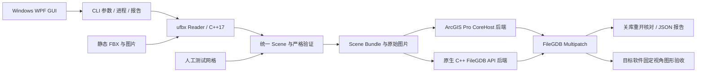

# V0.1.4 架构

Reader 与数据库 API 无直接依赖。C++ 内核使用 `gmb::Scene` 表达 Nodes、Meshes、Materials、Textures、坐标元数据与诊断。每个节点实例展开为独立网格；顶点是完整角点，避免位置相同但 UV/法线不同的点被合并。纹理按 SHA-256 内容寻址，材质绑定独立保留。

Windows GUI 使用 WPF，独立界面逻辑项目处理参数校验与异步子进程调用。它直接调用同目录 CLI，参数逐项传递，不拼接 shell 命令；窗口显示日志与真实报告结果。GUI 不加载 FileGDB 或 Pro 数据库 API，也不改变 Scene 协议与材质处理规则。

`conversion_profile` 随 Scene Bundle 和写库报告传递；CLI 与 GUI 均核对实际报告策略与请求一致。CLI 默认 `strict`，GUI 显式显示并默认选择 `gis-static`。兼容处理只发生在 Reader，按材质/网格记录诊断；后端仍执行完整几何、UV、材质和纹理核验。GUI 的中文摘要是展示层，不能替代成功状态核验。具体政策见 [compatibility.md](compatibility.md)。

V0.1.3 缓存每个网格材质的 UV 选择；中间 `scene.json` 使用紧凑 JSON，避免角点数组的重复缩进占用磁盘。用户报告仍保留可读缩进，数据值和角点边界不变。

V0.1.4 对网格角点和三角形逐项序列化到文件流，避免同时保留完整 JSON DOM 与其字符串副本。仍使用相同的 JSON 数值和字符串编码，原有临时目录、失败清理及新路径保护不变。GUI 分块排空进程的两路输出，对每路仅发送有限的预览与折叠摘要；原始转换报告不截断。

GIS 静态策略还可在 Reader 中修复安全识别的 JPEG 文件封装：只补 JFIF APP0，不重新压缩或旋转图片，原始和修复后的散列进入诊断。两个后端都消费同一份明确记录的中间包字节；它们不各自隐式转码。严格模式拒绝需要修复的封装。

Reader 统一右手 Z-up/米，烘焙 geometry_to_world；负行列式调整三角形绕序，法线用逆转置转换。源节点矩阵只作追溯信息。坐标模块另做平移和 WKID 赋值，不重新应用源矩阵。

Scene Bundle 是可审阅、可复制的内部协议，**不是 FileGDB 替代品**。契约见 [bundle-format.md](bundle-format.md)。后端通过进程参数调用，没有把文件名拼进 shell 命令；.NET/Pro 依赖不进入 C++ 库。CLI 通过 `--backend` 选择后端，验证其最终报告状态、后端名称、版本、要素类、要素数和重开读回级别后才报告转换成功；外部旧 writer 不能绕过当前版本的 UV 规则。

原生后端是独立 MSVC x64 程序，直接使用官方 FileGDB API 1.5.5 创建数据库、要素类与包含材质/纹理的 Multipatch ShapeBuffer，转换进程不加载 Pro。它使用 Windows WIC 解码 PNG，JPEG 仍保留压缩字节。SDK 的 Microsoft C++ ABI 不与 MinGW 构建的内核跨库混用；两者通过文件和进程边界协作。本交付附带官方 release FileGDBAPI.dll、原始许可和来源记录；完整 SDK、开发工具、调试库与 Pro 程序集不打包。

Pro 后端将三角形按材质分为 PatchType.Triangles，每个网格成为一个要素。写入先发生在新建临时 GDB，关闭连接后重开核对；通过才移动到最终路径。PNG 存未预乘 RGBA8；JPEG 保留原压缩文件内容。材质 RGB/透明度、UV 和空间坐标的目标存储精度在报告中说明。法线的 builder 单精度值和 GDB 的 1/128 分量量化分开核对；报告记录源法线摘要及方向误差，不把量化误写为无损。

两个后端均对所有有 UV 的 patch 在目标写入阶段应用 `S=U, T=1-V`，未绑定纹理的材质也采用相同 UV 语义。Scene Bundle 保留 FBX 源 UV，PNG 解码行序和 JPEG 文件字节不倒置。目标读回验证与映射后的 UV 比较，源 UV 与目标 UV 不再以原数值相同作为方向正确的依据。该变化修复首版显示调查中发现的上下方向差异；当前图形结果见 [V0.1.1 验证记录](validation-v0.1.1.md)。

每个后端的读回器只证明其核对项；跨后端核验和目标软件显示另行完成。原生后端支持 `--input <bundle> --verify-gdb` 的源数据对照，也支持 `--verify-gdb <copied.gdb> --expected-report <native-report.json> --report <new.json>` 的独立副本核验。后者不读取原 bundle，核对原报告保存的要素属性与完整目标 ShapeBuffer 散列；该内容散列用于一致性对照，不是数字签名或来源认证。

数据库写入保持单线程。没有性能优先的并行写库或跨模型共享数据库状态。超大模型、运行时间和内存峰值需要在正确性验收后基于真实数据测量。

## 错误契约

CLI 退出码：0 成功；2 用法/已有输出冲突；3 所选策略下验证不通过；4 后端不可用；5 后端执行失败；6 输入解析/IO/其他操作失败。所有失败均不得生成“完整保真成功”的报告。中间包 `prepared`、检查 `inspected`、目标库 `written_and_readback_verified` 为不同状态。

## 核实过的技术依据

- [ufbx 节点、坐标空间与变换](https://ufbx.github.io/elements/nodes/)
- [ufbx 网格与实例材质](https://ufbx.github.io/elements/meshes/)
- [ufbx 材质/纹理参考](https://ufbx.github.io/reference)
- [Esri Pro SDK 官方仓库](https://github.com/Esri/arcgis-pro-sdk)
- [Esri FileGDB API 官方仓库](https://github.com/Esri/file-geodatabase-api)

Pro 几何/材质 API 的签名由本机 3.6.2 的 ArcGIS.Core.xml 与 CoreHost.xml 确认。原生材料缓冲区实现以官方 SDK 头文件及其随附格式资料为依据；接口存在、源码完成、SDK 自身读回、跨后端读取、目标显示属于不同证据，实际验收结果单独记录。
