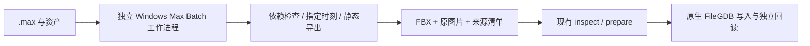

# .max 入库设计路线

状态：设计方案，尚未实现 `.max` 输入。现有 CLI、GUI、Python 均不会把 `.max` 当作已支持格式。

## 推荐架构

使用可选的 Windows 3ds Max Batch 预处理工作进程，将 `.max` 及其资产解析为受约束的静态 FBX，再交给当前共享转换链。FileGDB 核心和 Linux 端继续独立运行，不引入 3ds Max 或 ArcGIS Pro 依赖。

Autodesk 提供 Batch 运行 MAXScript/Python 的入口，以及加载 MAX、导出 FBX 的脚本接口；据此选择由官方运行时求值场景。版本、插件和授权必须在实施时按目标环境确认，不能承诺任意版本 `.max` 均可直接解析。[Batch 官方用法](https://help.autodesk.com/cloudhelp/2018/ENU/3DSMax-Batch/files/GUID-48A78515-C24B-4E46-AC5F-884FBCF40D59.htm)、[加载及导出接口](https://help.autodesk.com/cloudhelp/2024/ENU/MAXScript-Help/files/MAXScript-Tools-and-Interaction/File-Access/3ds-Max-Scene-Files-Access/GUID-624D3D05-B15D-4A97-9F15-DA35CDB0DDD2.html)。

## 分阶段交付

| 阶段 | 实现 | 完成门槛 |
| --- | --- | --- |
| M1 环境探测 | 选择 3ds Max/FBX 导出器版本；工作进程启动、授权及插件预检 | 指定测试 MAX 可无人值守加载；缺插件、版本不兼容有明确错误 |
| M2 静态几何 | 固定导出时刻，求值修改器/实例，保存单位与坐标来源 | 嵌套变换、镜像、非均匀缩放、多个材质和角点边界逐项核对 |
| M3 基础材质 | 支持约定的标准材质、图片与透明度；复杂材质分类 | 无未知材质静默变灰、无贴图/UV 丢失；失败可定位到节点与通道 |
| M4 高级材质烘焙 | 可选 V-Ray/Corona/Arnold/Physical 材质适配，显式选择烘焙策略 | 每种插件/版本单独验收；记录源材质、采样、颜色空间、分辨率和生成图片散列 |
| M5 客户端接入 | CLI/GUI/Python 的可选预处理入口、超时、取消与日志 | 日志有界且标明截断；仅当前任务输出可清理；最终成功仍由 GDB 回读决定 |

M1–M3 可作为首期。M4 不应以忽略复杂材质通道的方式提前宣称完成。没有 Max 环境的用户继续手动导出 FBX/GLB/glTF/OBJ，再运行现有入库链路。

## 适配器输入与输出契约

独立 JSON 任务清单建议包含 `adapter_protocol_version`、请求 ID、源绝对路径及 SHA-256、显式资源目录、Max 版本、插件清单、时间点、输出暂存目录、材质策略与缺图策略。初期只接收本机路径；Linux 可消费导出的中间包，将来的远程服务应另行设计。

输出清单记录：

- 实际加载的运行时/导出器/插件版本、源及外部引用散列。
- 选取时间、求值节点数、网格数、角点/三角形数、材质/UV 通道清单。
- 单位、轴向、源世界矩阵与导出包围盒。原点只由现有转换器应用。
- 原贴图、替换或烘焙贴图的来源、散列和具体处理策略。
- 所有省略、缺失和失败，不以导出器返回码单独判定成功。

外部引用和缺失插件应中止，避免把代理/占位对象当作完整几何。缺图片可沿用用户明确指定的材质颜色回退；不可读、损坏资产与未知材质仍失败。动画、蒙皮与修改器通过 Max 求值到显式时间点，必须标明保存的是静态快照。

## 运行及文件保护

每个任务新建独立工作进程和独占目录，不接管用户打开的 Max 会话。源 MAX 和资产仅用于读取，不调用 `saveMaxFile` 覆盖源。导出完成后才将暂存文件以共享 no-replace 操作提交，失败只清理本任务创建的路径。中间 FBX、贴图和报告均不得覆盖已有文件。

场景可能包含自动执行脚本，官方命令行说明也指出启动脚本与场景回调的执行行为。因此工作进程使用独立低权限账户/环境，按选定 Max 版本配置场景安全机制，禁止任务清单注入脚本；不把模型路径拼接为可执行 MAXScript。[官方脚本启动说明](https://help.autodesk.com/cloudhelp/2026/ENU/MAXScript-Help/files/MAXScript-Introduction/General-MAXScript-Topics/GUID-A04C0E75-F82A-41AC-92E8-D7CB1D797430.html)。

## 最终验收矩阵

1. 真实 `.max` 样本：基础贴图、alpha、UV 接缝、硬法线、多材质、实例、镜像、系统单位和指定动画帧。
2. 失败样本：缺插件/外部引用、未知材质、损坏图片、取消、超时、输出已存在、并发写入、Unicode 路径。
3. Windows 从 MAX 起点写出 GDB；同一中间包在 Ubuntu 24.04 写出并回读；复制 GDB 后再次独立验证。
4. 核对 Max 侧统计/来源清单与 Scene Bundle，再核对 native 几何、材质、纹理、WKID、origin 验证结果。
5. 用户目标 GIS 的外观验收单独记录。自动回读通过不能代表渲染器外观完全相同。

实施前需收集代表性 MAX 样本、产生文件的 Max 年份/插件版本、需要的静态时间点，以及可用运行授权；这些是 M1 的输入，不是当前已验证能力。
